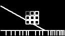
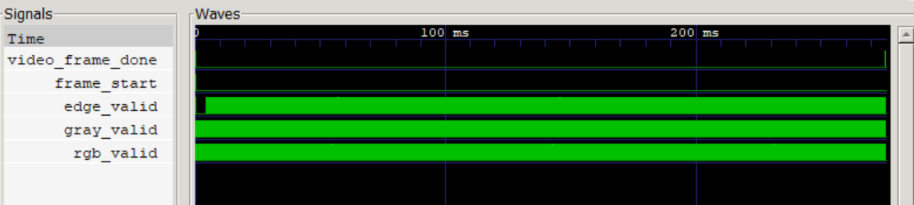

# sobel_00_rtl_sim RTL仿真报告

---

## 一、实验目标

本实验是ZYNQ7020图像处理课程设计的预备仿真实验，不依赖Vivado工程和开发板，仅使用Icarus Verilog进行纯RTL仿真，验证UART图像接收、RGB转灰度、Sobel边缘检测和视频像素流输出等核心功能。

完成本实验后，应能说明以下内容：

- 128×72 RGB888图像如何以UART字节流方式输入系统；
- UART帧头、行头和像素数据的完整通信格式；
- `rgb_to_gray`模块如何将RGB彩色像素转换为灰度值；
- `sobel_core`模块如何基于3×3邻域计算产生边缘强度图；
- 如何根据仿真波形（`frame_start` → `rgb_valid` → `gray_valid` → `edge_valid` → `edge_frame_done`）判断一帧图像处理是否完成。

---

## 二、系统架构与数据流

仿真系统采用流水线架构，数据从UART接口输入，依次经过各处理模块，最终输出边缘检测结果。顶层模块 `sobel_system` 将五个子模块级联，整体数据流如下：

```
input_rgb.hex → UART字节流模型（testbench中按UART协议逐字节发送）
    → uart_rx：UART接收器，将串行bit流解码为并行字节
    → image_frame_rx：帧协议解析器，从字节流中提取RGB像素坐标和颜色值
    → rgb_to_gray：RGB→灰度转换模块
    → sobel_core：Sobel边缘检测核心（3×3模板卷积）
    → video_stream_model：视频流输出模型，将边缘灰度数据转为RGB格式输出
```

---

## 三、输入图像格式与UART帧格式

### 3.1 输入图像格式

本实验使用的输入图像为 **128×72像素** 的 **RGB888格式** 图像，由Python脚本 `gen_input_rgb.py` 生成。像素数据以十六进制格式存储于 `input_rgb.hex` 文件中，每个像素占用3个字节（R、G、B各1字节），图像总计包含 128×72×3 = **27,648字节**。

修改后的输入图像包含以下四种特征区域，用于全面测试Sobel边缘检测能力：

- **顶部灰度阶梯条**：将图像宽度均分为8个区域，每个区域灰度值递增（0、32、64、...、224），用于测试Sobel算子对不同灰度级水平边缘的响应能力。
- **左侧倾斜阶跃边**：一条从左下到右上方向的倾斜暗线（灰度值40），用于测试Sobel算子对倾斜边缘的检测能力。
- **中心3×3灰阶方块阵列**：在图像中心放置3×3共9个灰度递增方块（灰度值从60到228），每个方块大小为 `min(W,H)/8` 像素，方块间有2像素间距，用于测试小区域边缘检测。
- **底部楔形条纹**：在图像底部（`y > 5/6×H`）生成由疏到密的黑白交替条纹，周期从宽到窄变化，用于测试Sobel算子对不同空间频率的响应。

### 3.2 UART帧格式

仿真中的UART帧格式与后续上板实验保持一致，便于算法验证后直接移植到硬件平台。

**帧头（Frame Header）格式：**

| 同步字节0 | 同步字节1 | 宽度低8位 | 宽度高8位 | 高度低8位 | 高度高8位 | 格式标识 |
|:---------:|:---------:|:---------:|:---------:|:---------:|:---------:|:--------:|
| 0x55      | 0xAA      | 0x80 (128)| 0x00      | 0x48 (72) | 0x00      | 0x18 (RGB888) |

**行头（Line Header）格式：**

| 同步字节0 | 同步字节1 | 行号低8位 | 行号高8位 |
|:---------:|:---------:|:---------:|:---------:|
| 0x33      | 0xCC      | 行号低8位 | 行号高8位 |

每行像素数据紧跟行头之后，每个像素3字节（R、G、B顺序），每行128个像素，每行共 128×3 = 384字节。一帧共72行，完整帧数据量为：

```
帧头 7B + 72 × (行头 4B + 像素 384B) = 7 + 27,936 = 27,943 字节
```

UART通信参数：波特率 **1,000,000 bps**，时钟频率 **12 MHz**，无校验位，1位停止位。

---

## 四、关键模块功能说明

### 4.1 rgb_to_gray模块（RGB转灰度）

**功能概述：**

`rgb_to_gray` 模块将输入的RGB888彩色像素转换为8位灰度值，采用ITU-R BT.601标准的加权公式。模块为纯组合逻辑加一级寄存器输出，每个时钟周期处理一个像素，具有1个时钟的流水线延迟。

**核心算法：**

灰度计算公式为：

```
Gray = R × 77 + G × 150 + B × 29
（结果右移8位，即取高8位）
```

其中77、150、29分别对应BT.601标准中R、G、B三通道的亮度权重系数（约0.299、0.587、0.114），通过整数近似实现（77+150+29=256），避免浮点运算，便于FPGA硬件实现。

**端口说明：**

| 端口名 | 方向 | 位宽 | 说明 |
|:------:|:----:|:----:|:-----|
| `rgb_valid` | 输入 | 1 | RGB像素有效信号 |
| `r, g, b` | 输入 | 8×3 | RGB三通道像素值 |
| `x, y` | 输入 | 16×2 | 像素坐标 |
| `gray_valid` | 输出 | 1 | 灰度值有效信号（延迟1拍） |
| `gray` | 输出 | 8 | 转换后的灰度值 |

**设计要点：**

- 计算结果 `gray_calc` 为16位（8位×8位乘法累加），最终取高8位 `gray_calc[15:8]` 作为灰度输出，等效于除以256取整。
- `gray_valid` 比 `rgb_valid` 延迟1个时钟周期，与gray数据同步输出。
- 像素坐标 (x, y) 随数据流水线同步传递，便于下游模块定位。

### 4.2 sobel_core模块（Sobel边缘检测）

**功能概述：**

`sobel_core` 模块是整个系统的核心算法模块，采用经典Sobel算子对灰度图像进行边缘检测。模块内部使用两行行缓冲（`line0`、`line1`）实现3×3滑动窗口，在像素流式输入的情况下实时计算每个像素的边缘强度。

**Sobel算子模板：**

水平梯度 Gx 和垂直梯度 Gy 的卷积模板分别为：

```
Gx 模板:          Gy 模板:
-1  0  +1        -1  -2  -1
-2  0  +2         0   0   0
-1  0  +1        +1  +2  +1
```

**边缘强度计算：**

```
Gx = -top0 + top2 - 2×mid0 + 2×mid2 - bot0 + bot2
Gy = -top0 - 2×top1 - top2 + bot0 + 2×bot1 + bot2
|Gx| + |Gy|  →  edge_data（钳位到0~255）
```

其中 `top0~top2`、`mid0~mid2`、`bot0~bot2` 为3×3窗口中的9个像素值，分别对应上一行、当前行和下一行。边缘强度采用L1范数（`|Gx|+|Gy|`）近似，而非L2范数（`√(Gx²+Gy²)`），以减少硬件开销。若结果超过255，则钳位为255（0xFF）。

**行缓冲与流水线结构：**

模块内部维护两个行缓冲 `line0` 和 `line1`，宽度均为 WIDTH（128）个8位寄存器。每收到一个新像素，`line0` 保存上一行对应位置的值，`line1` 保存当前行已接收的值，结合当前输入像素构成3×3窗口。同时，`top0~top2` 等寄存器保存列方向上的历史值，实现滑动窗口效果。这种结构使得模块在像素流式输入时只需1个像素的行延迟即可输出边缘结果。

**边界处理：**

对于图像的边界像素（`x=0`、`y=0`、`x=WIDTH-1`、`y=HEIGHT-1`），模块将对应的窗口位置补零处理。边界像素的输出固定为0（黑色），不进行边缘计算。此外，当所有像素处理完毕后，模块通过 flush 机制补输出最后一行和最后一列的边界像素（值为0），最终发出 `edge_frame_done` 信号表示一帧处理完成。

**主要端口：**

| 端口名 | 方向 | 位宽 | 说明 |
|:------:|:----:|:----:|:-----|
| `frame_start` | 输入 | 1 | 帧起始信号，重置内部状态 |
| `gray_valid` | 输入 | 1 | 灰度像素有效 |
| `gray` | 输入 | 8 | 灰度像素值 |
| `gray_x, gray_y` | 输入 | 16×2 | 像素坐标 |
| `edge_valid` | 输出 | 1 | 边缘像素有效 |
| `edge_frame_done` | 输出 | 1 | 一帧处理完成标志 |

---

## 五、Testbench设计说明

仿真 Testbench（`sobel_system_tb.v`）模拟了完整的UART图像传输过程，并包含错误注入测试以验证系统的鲁棒性。主要测试流程如下：

### 1. 初始化阶段

复位系统（`rst_n` 拉低20个时钟周期后释放），从 `input_rgb.hex` 文件读入全部像素数据。

### 2. 错误帧测试

- **错误帧头**：发送 0x55 后跟 0x00（而非 0xAA），验证 `image_frame_rx` 能正确检测并报 `frame_error`
- **错误格式标识**：发送合法帧头但格式标识为 0x99（非 0x18），验证格式校验功能
- **错误行号**：发送行号5超过帧高度4，验证行号范围校验功能

### 3. 正常帧传输

发送完整的 128×72 RGB888 图像帧数据（帧头 + 72行×(行头+像素数据)），每字节按UART协议逐位发送（1位起始位 + 8位数据位 + 1位停止位）。

### 4. 输出验证

等待 `video_frame_done` 信号（超时阈值3,000,000个时钟周期），验证视频输出像素数等于 128×72 = 9,216，最后将输出数据写为PGM灰度图文件。

**仿真参数：**

- 时钟频率：12 MHz（CLK_PERIOD ≈ 83.3 ns）
- UART波特率：1,000,000 bps（CLKS_PER_BIT = 12）
- 图像尺寸：128×72像素
- 仿真工具：Icarus Verilog（iverilog + vvp）

---

## 六、仿真结果

### 6.1 输入图像

下图为 `gen_input_rgb.py` 生成的 128×72 测试输入图像。图像包含顶部灰度阶梯、左侧倾斜边、中心3×3灰阶方块阵列和底部楔形条纹四个特征区域。


<p align="center">图1：输入测试图像（128×72 RGB888）</p>

### 6.2 Sobel输出图像

下图为经过Sobel边缘检测后的输出灰度图。白色区域表示强边缘，黑色区域表示无边缘。可以看到各特征区域的边缘被清晰提取：



<p align="center">图2：Sobel边缘检测输出图像</p>

**输出图像分析：**

- **顶部灰度阶梯**：相邻灰度块之间产生了清晰的垂直分界线，灰度变化越大的相邻块，边缘响应越强。阶梯条的水平边界（y方向）也产生了水平边缘线。
- **左侧倾斜边**：倾斜边在Sobel输出中呈现为一条清晰的亮线，说明算子对任意方向的灰度跳变都能有效检测。
- **中心3×3方块**：每个方块的四条边均被提取为白色边缘线，方块之间的间距区域为黑色（无边缘）。方块灰度值差异越大，边缘响应越强。
- **底部楔形条纹**：黑白交替条纹的每个边界都被提取为边缘。条纹越密集的区域，边缘线间距越小但仍可分辨。

### 6.3 关键波形分析

使用GTKWave打开 `sobel_system_tb.vcd` 波形文件，观察以下关键信号的时序关系：



<p align="center">图3：仿真波形截图（GTKWave）</p>

波形中各关键信号的含义与时序关系：

- **`frame_start`**：帧起始信号，在 `image_frame_rx` 成功解析帧头后置高1个时钟周期，标志 `sobel_core` 开始处理新一帧。
- **`rgb_valid`**：RGB像素有效信号，在 `image_frame_rx` 每输出一个有效像素时置高，持续整个帧传输过程。从波形可见该信号呈密集脉冲状。
- **`gray_valid`**：灰度像素有效信号，由 `rgb_to_gray` 模块输出，比 `rgb_valid` 延迟1个时钟周期，表明流水线正常工作。
- **`edge_valid`**：边缘像素有效信号，由 `sobel_core` 输出。该信号在 `gray_valid` 之后出现，且在图像数据全部输入后仍有输出（flush阶段），用于输出最后的边界像素。
- **`video_frame_done`**：视频帧完成信号，由 `video_stream_model` 在接收到 `edge_frame_done` 后输出。该信号置高表示一帧边缘检测结果已全部输出完毕。

从波形可以观察到完整的数据流水线时序：帧头接收 → `frame_start` 脉冲 → `rgb_valid`/`gray_valid`/`edge_valid` 依次有效（流水线各级延迟） → `edge_frame_done` 脉冲 → `video_frame_done` 脉冲。整个仿真从开始到完成约250ms（仿真时间），对应约3,000,000个时钟周期。

---

## 七、仿真中遇到的问题及解决方法

### 问题1：仿真运行时间过长

由于采用真实的UART逐位传输协议（波特率1M，每字节12个时钟周期），一帧 27,943 字节的数据传输需要约 335,316 个时钟周期。加上帧头解析、流水线延迟和 flush 阶段，整体仿真时间较长。

**解决方案：** 将波特率从默认的 115,200 提高到 1,000,000，同时将时钟频率设为 12MHz（CLKS_PER_BIT=12），大幅缩短仿真时间。Makefile中通过宏定义 `CLK_FREQ` 和 `BAUD_RATE` 实现参数化配置。

### 问题2：边缘图像边界出现未定义像素

在早期版本中，`sobel_core` 在 flush 阶段的边界处理逻辑不够完善，导致输出图像的最右列和最底行出现随机值。

**解决方案：** 在 `sobel_core` 中增加 `flush_active` 和 `flush_bottom_row` 状态机，在所有像素处理完成后，逐个补输出边界像素（值固定为0），最终发出 `edge_frame_done` 信号，确保输出图像尺寸与输入一致。

### 问题3：VCD波形文件体积过大

完整的一帧仿真产生的VCD文件超过120MB（本实验约126MB），给查看和分析带来不便。

**解决方案：** 在testbench中使用 `$dumpvars` 只记录关键信号（而非整个设计的全部信号），包括顶层端口、流水线中间信号和状态机状态，有效控制了文件体积。同时使用GTKWave的信号分组和缩放功能辅助分析。

### 问题4：输入图像特征设计

最初使用彩色渐变图像作为输入，但由于 `sobel_core` 最终输出为灰度边缘图，彩色图像的边缘特征不易直观评估算法效果。

**解决方案：** 修改 `gen_input_rgb.py` 生成包含明确几何特征（阶梯、斜线、方块阵列、楔形条纹）的灰度测试图案，使每个区域的预期边缘输出清晰可辨，便于验证算法正确性。

---

## 八、实验总结

通过本实验，完成了 `sobel_00_rtl_sim` 的完整RTL仿真验证，主要成果包括：

- 成功搭建了基于Icarus Verilog的纯仿真环境，无需Vivado和开发板即可验证算法；
- 验证了UART帧协议解析的正确性，包括帧头识别、格式校验、行头解析和像素提取；
- 验证了 `rgb_to_gray` 模块的BT.601灰度转换功能，输出灰度值与理论计算一致；
- 验证了 `sobel_core` 的3×3滑动窗口边缘检测功能，输出边缘图清晰反映了输入图像的各特征区域；
- 通过错误帧测试验证了系统对异常输入的容错能力；
- 深入理解了图像处理流水线的时序关系和数据流设计方法。

本实验为后续的上板验证（sobel_01~05）奠定了算法和数据流基础，确保核心RTL逻辑在脱离硬件环境的条件下已通过充分验证。
