# ZYNQ7020 图像处理实验报告

## 一、实验概述

本课程设计以黑金 ZYNQ7020 开发板为平台，完成从 RTL 仿真到 HDMI 显示的图像处理系统。实验路线如下：

```
RTL 仿真 → HDMI 固定图片显示 → PL Sobel 边缘检测 → PC 串口发送图像 → PS 接收写入 AXI BRAM → PL 读取 BRAM 并 HDMI 显示 → UART 输入图像的 PL Sobel 显示 → 上位机命令控制 HDMI 显示模式
```

---

## 二、实验 01：HDMI 固定图片显示

### 2.1 实验目标

验证 ZYNQ7020 开发板的 HDMI 输出链路，理解 128×72 图片如何通过 10 倍放大映射到 1280×720 HDMI 画面。

### 2.2 系统架构

```
image_rom_128x72 (128×72 RGB) → hdmi_image_display (720p时序+放大) → rgb2dvi_0 (TMDS编码) → HDMI显示器
```

| 参数 | 值 |
|------|-----|
| 输入图片 | 128×72 |
| HDMI 输出 | 1280×720 |
| 缩放倍数 | 10×10 |

### 2.3 关键代码说明

`hdmi_image_display.v` 中的缩放参数：

```verilog
H_ACTIVE = 1280
V_ACTIVE = 720
IMG_WIDTH = 128
IMG_HEIGHT = 72
SCALE_X = H_ACTIVE / IMG_WIDTH   // = 10
SCALE_Y = V_ACTIVE / IMG_HEIGHT  // = 10
```

每个原始像素在 HDMI 输出中被放大为 10×10 的像素块。ROM 中像素数据格式为 `24'hRRGGBB`，地址由 `image_x` 和 `image_y` 坐标计算。

### 2.4 实验现象

HDMI 显示器正常识别 1280×720 输入，屏幕显示 128×72 图片放大后的画面。


<p align="center">图1：HDMI显示128×72图片放大后的画面</p>


<p align="center">图2：Vivado综合实现完成</p>

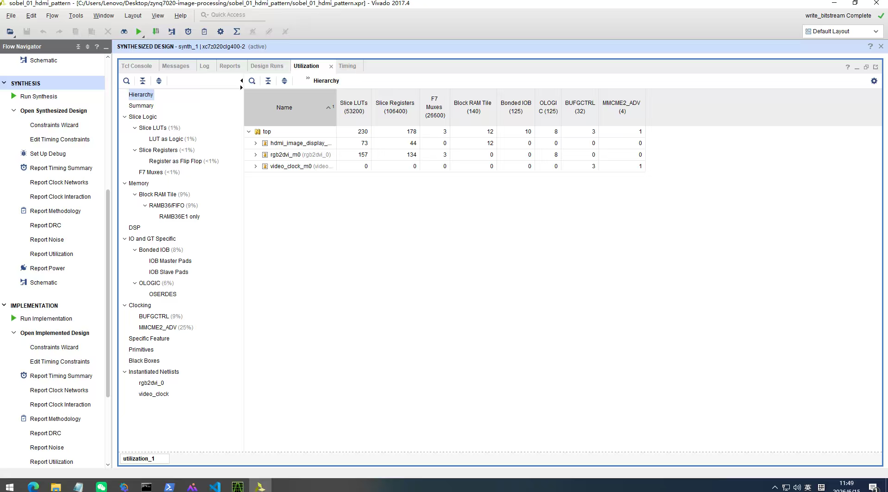

<p align="center">图3：实验01资源利用率</p>

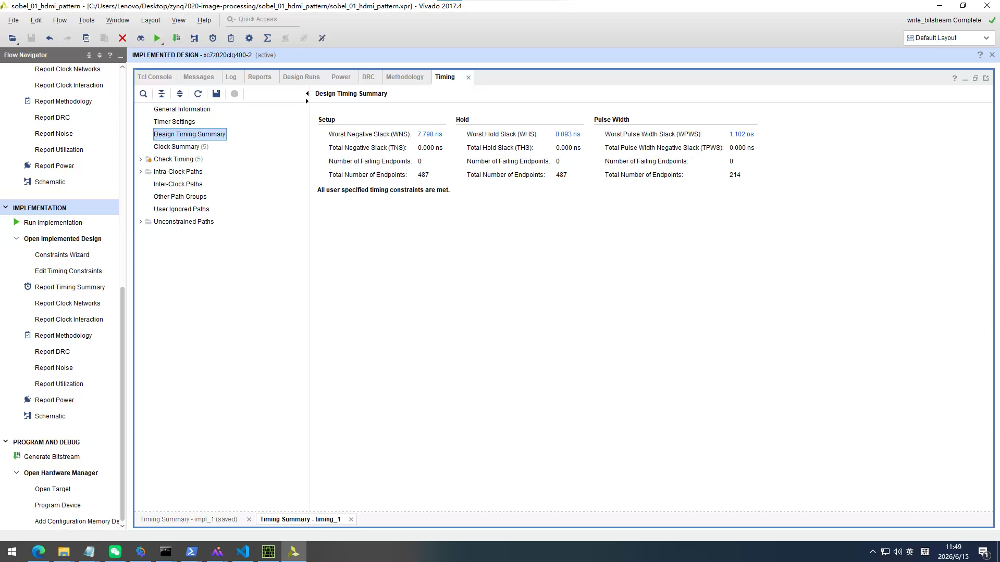

<p align="center">图4：实验01时序结果</p>

### 2.5 扩展实验：更换固定图片

修改 `image_rom_128x72` 中的像素数据，替换为新的测试图案。HDMI 显示了新的彩色图案，包含红色竖条、白色方形、黑色对角交叉线和渐变背景。

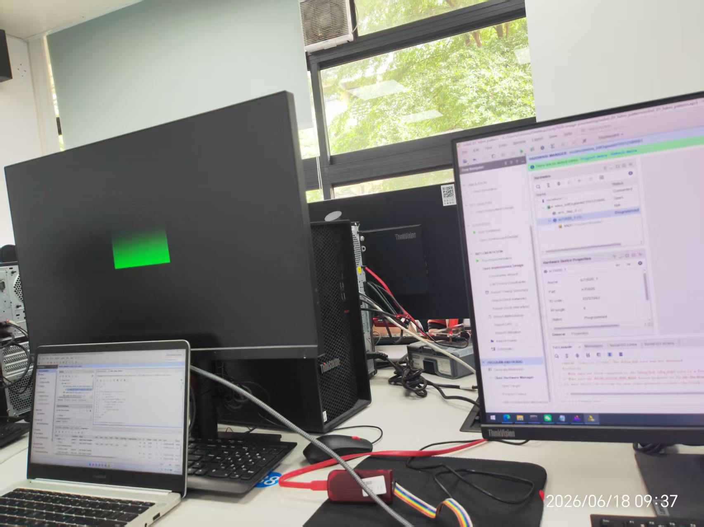

<p align="center">图5：扩展实验-更换固定图片后的HDMI显示效果</p>

---

## 三、实验 02：固定图片 Sobel 边缘检测

### 3.1 实验目标

在实验 01 的基础上加入灰度转换和 Sobel 边缘检测，PL 端完成图像处理后通过 HDMI 显示边缘结果。

### 3.2 系统架构

```
image_rom_128x72 (RGB888) → rgb_to_gray → sobel_core → edge_mem → hdmi_sobel_display → rgb2dvi_0 → HDMI
```

| 参数 | 值 |
|------|-----|
| 输入图片 | 128×72 RGB888 |
| Sobel 输出 | 128×72 8 bit edge |
| HDMI 输出 | 1280×720（10×10放大） |

### 3.3 关键模块说明

**rgb_to_gray**：采用 BT.601 标准加权公式 `Gray = (77×R + 150×G + 29×B) >> 8`，将 RGB888 转换为 8 位灰度。

**sobel_core**：使用 3×3 Sobel 算子进行边缘检测，两行行缓冲实现滑动窗口：

```
Gx 模板:          Gy 模板:
-1  0  +1        -1  -2  -1
-2  0  +2         0   0   0
-1  0  +1        +1  +2  +1
```

边缘强度：`|Gx| + |Gy|`，钳位到 0~255。

**edge_mem**：缓存一帧完整的边缘检测结果，供 HDMI 显示时随机读取。

### 3.4 实验现象

HDMI 显示器输出固定图片的 Sobel 边缘检测结果，画面为黑白灰度边缘图。

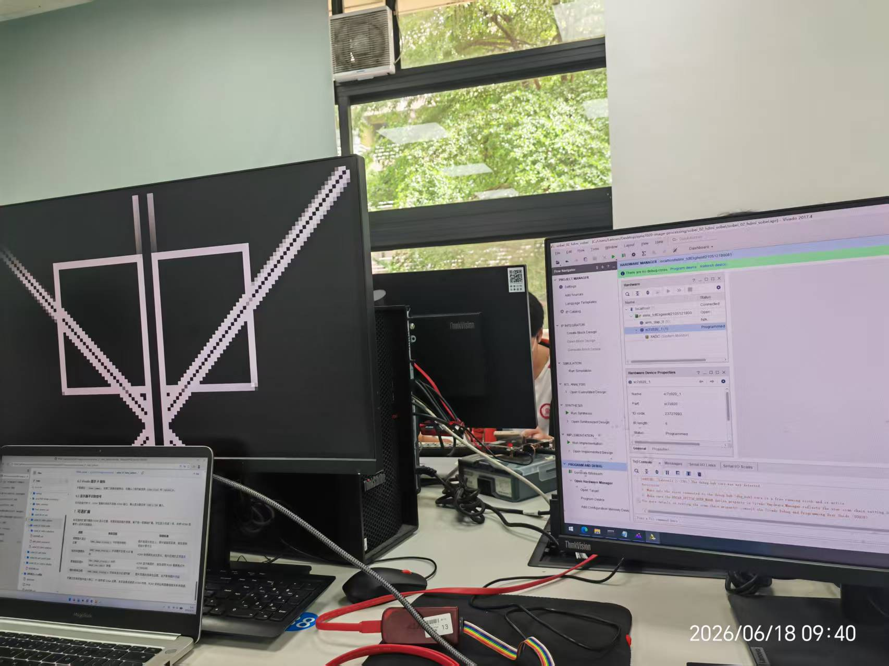

<p align="center">图6：HDMI显示固定图片的Sobel边缘检测结果</p>


<p align="center">图7：实验02资源利用率</p>


<p align="center">图8：实验02时序结果</p>

### 3.5 扩展实验：边缘反色显示

修改 `hdmi_sobel_display.v` 的 RGB 输出映射，将黑底白边改为白底黑边（`R = G = B = ~edge_data`）。

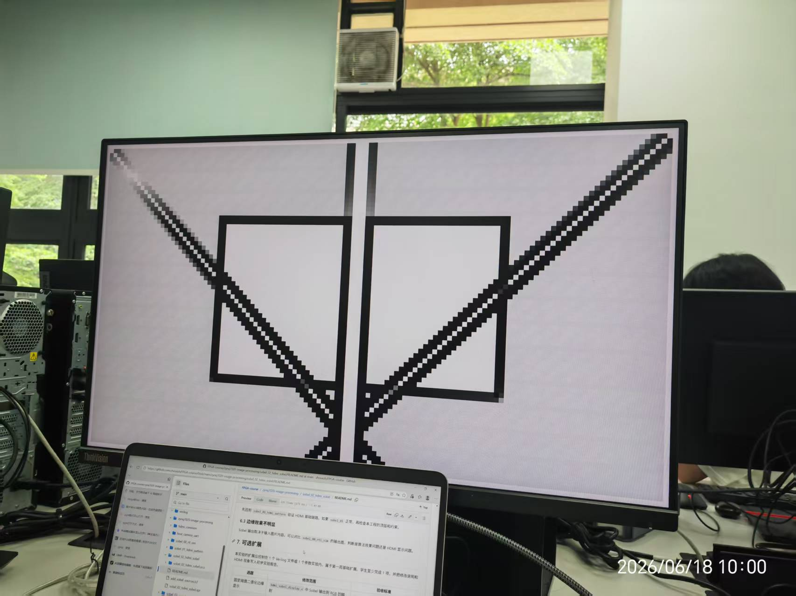

<p align="center">图9：扩展实验-边缘反色显示效果（白底黑边）</p>

---

## 四、实验 03：UART 传图 HDMI 显示

### 4.1 实验目标

实现 PC 端通过串口发送图像，ZYNQ PS 端接收并写入 AXI BRAM，PL 端从 BRAM 读取并通过 HDMI 输出。

### 4.2 系统架构

```
PC摄像头/图片 → USB串口(115200) → ZYNQ PS UART → PS解析帧数据 → AXI BRAM (0x00RRGGBB) → PL HDMI读BRAM → HDMI显示器
```

BRAM 地址映射：`address = 0x40000000 + ((y × 128 + x) << 2)`，每个像素 32 bit（低 24 位为 RGB888）。

### 4.3 串口协议

| 字段 | 格式 | 说明 |
|------|------|------|
| 帧头 | `55 AA width_l width_h height_l height_h 18` | width=128, height=72, 0x18=RGB888 |
| 行头 | `33 CC row_l row_h` | row 从 0 到 71 |
| 像素数据 | 每行 128×3 字节（R G B） | PS 写入 BRAM 为 0x00RRGGBB |

### 4.4 实验现象

串口打印启动信息后，PC 端发送图像，HDMI 显示器成功显示放大后的画面。

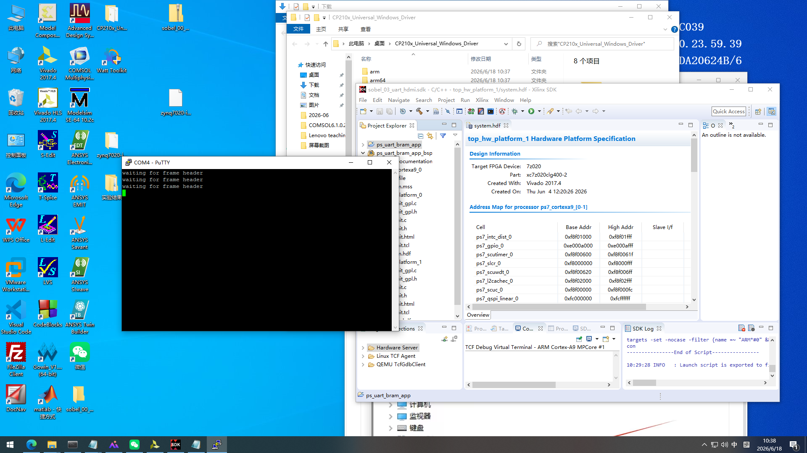

<p align="center">图10：串口调试助手显示PS程序启动信息</p>

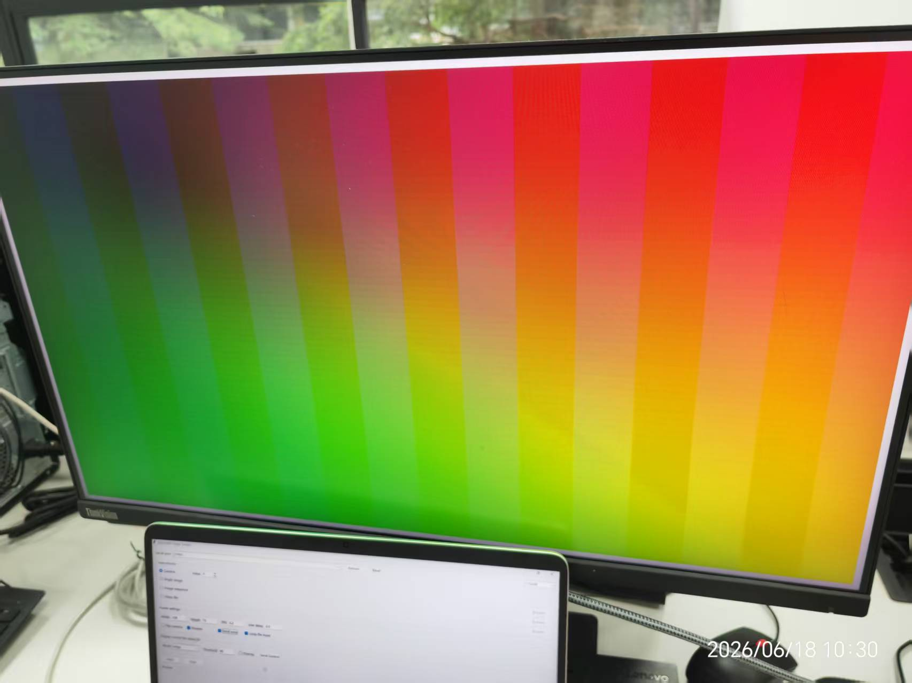

<p align="center">图11：HDMI显示PC端发送的彩色条纹图像</p>

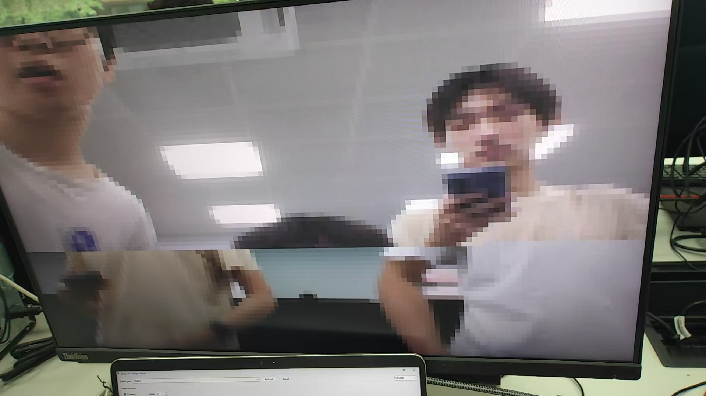

<p align="center">图12：摄像头图像通过UART传输后HDMI实时显示</p>

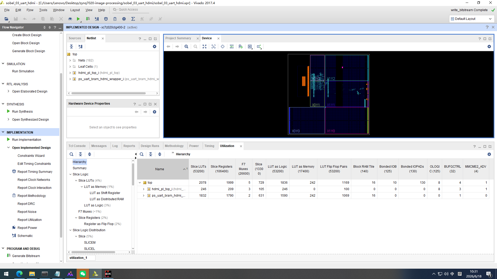

<p align="center">图13：实验03资源利用率</p>

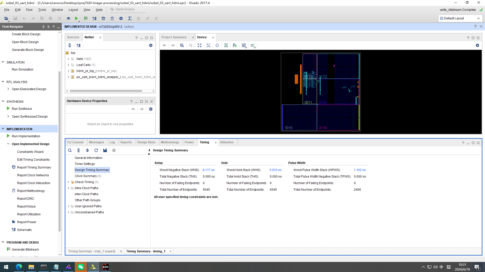

<p align="center">图14：实验03时序结果</p>

### 4.5 扩展实验：增加图像边框

修改 `hdmi_bram_display.v` 的显示区域判断逻辑，在图像周围增加红色单色边框。

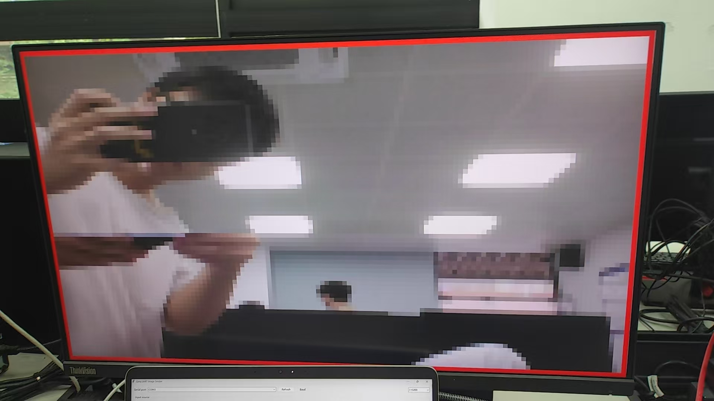

<p align="center">图15：扩展实验-HDMI图像周围添加红色边框</p>

### 4.6 帧率分析

115200 波特率下有效吞吐约 11520 byte/s，一帧 128×72 RGB888 数据约 27,648 字节，理论最高帧率不到 0.5 fps。实际使用 `--fps 0.2`。

---

## 五、实验 04：UART 输入图像 PL Sobel 显示

### 5.1 实验目标

在实验 03 基础上，PL 端从 BRAM 读取原始图像，完成灰度转换和 Sobel 运算，HDMI 显示边缘结果。

### 5.2 系统架构

```
PC → UART → PS → AXI BRAM(原图) → PL读取BRAM → PL rgb_to_gray → PL sobel_core → PL edge_mem → HDMI(边缘图)
```

与实验 03 的区别：

| 项目 | 实验 03 | 实验 04 |
|------|---------|---------|
| HDMI 显示 | 原始 RGB 图像 | PL Sobel 灰度边缘图 |

PL 端 HDMI 显示时：`R = G = B = edge_data`，输出黑白边缘图。

### 5.3 实验现象

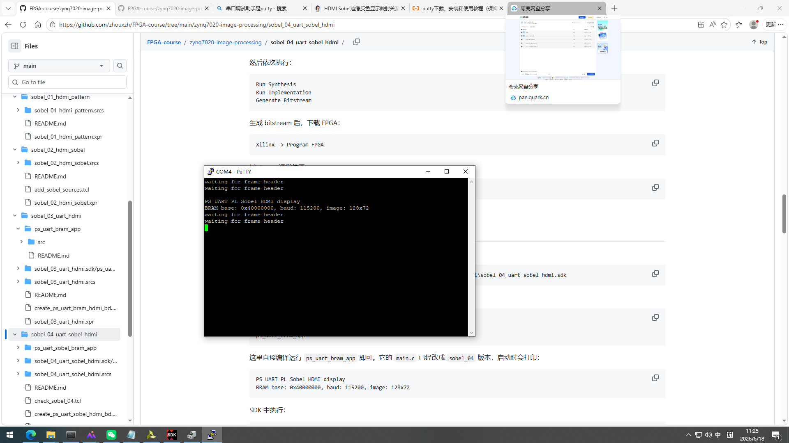

<p align="center">图16：串口显示sobel_04启动信息</p>

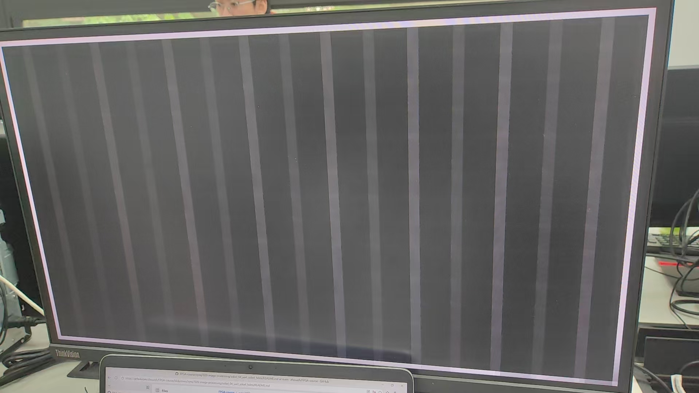

<p align="center">图17：测试图经PL Sobel处理后的边缘显示</p>

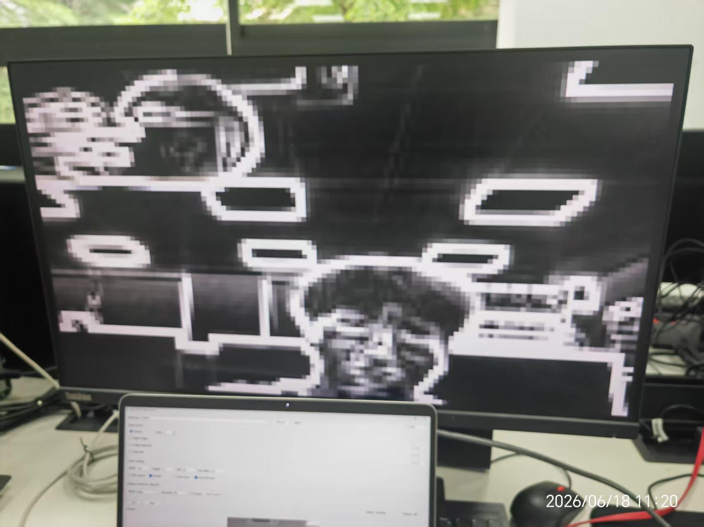

<p align="center">图18：摄像头图像连续更新中的Sobel边缘显示</p>

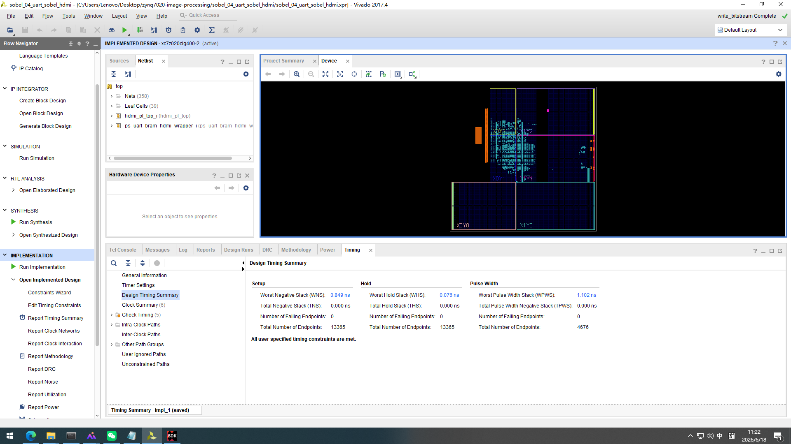

<p align="center">图19：实验04资源利用率</p>

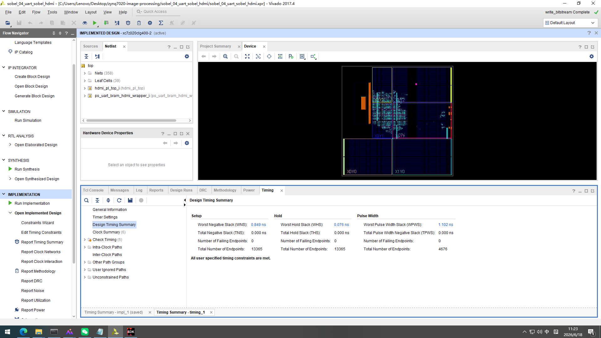

<p align="center">图20：实验04时序结果</p>

### 5.4 扩展实验：边缘图反色显示

修改 `hdmi_bram_sobel_display.v` 的 RGB 输出映射，将黑底白边改为白底黑边。

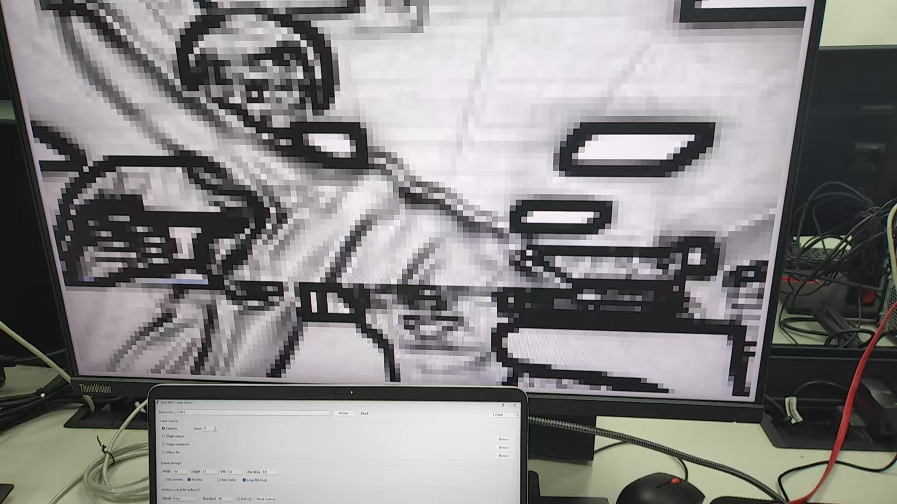

<p align="center">图21：扩展实验-边缘图反色显示效果1</p>

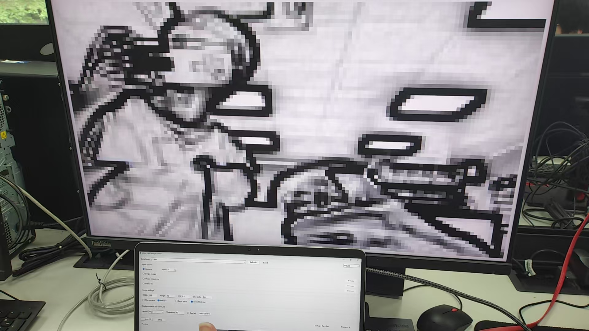

<p align="center">图22：扩展实验-边缘图反色显示效果2</p>

---

## 六、实验 05：上位机控制 HDMI 显示模式

### 6.1 实验目标

在实验 04 基础上增加 PC 命令控制显示能力，支持模式切换、阈值控制和彩色边缘叠加。

### 6.2 系统架构

```
PC图片/摄像头 → UART图像帧 → PS写入BRAM图像区 → PL读取图像(灰度+Sobel)
PC控制命令   → UART命令    → PS解析 → BRAM控制字区域 → PL读取控制字
                                                          ↓
                                    PL显示模式选择(阈值+叠加) → HDMI
```

BRAM 区域划分：

| 区域 | 地址偏移 | 用途 |
|------|----------|------|
| 图像 framebuffer | 0x0000 | 128×72×32bit，0x00RRGGBB |
| 控制字区域 | 0x9000 | display_mode / threshold / overlay_enable |

### 6.3 控制命令协议

控制帧格式：`a5 5a cmd value`

| cmd | value | 功能 |
|-----|-------|------|
| 0x01 | 0 | 原图 |
| 0x01 | 1 | 灰度图 |
| 0x01 | 2 | Sobel 二值化边缘图 |
| 0x01 | 3 | 原图 + 彩色边缘叠加 |
| 0x02 | 0~255 | 设置 Sobel 二值化阈值 |
| 0x03 | 0/1 | 关闭/打开彩色边缘叠加 |

### 6.4 仿真验证

使用 Icarus Verilog 仿真验证显示控制逻辑，仿真通过。

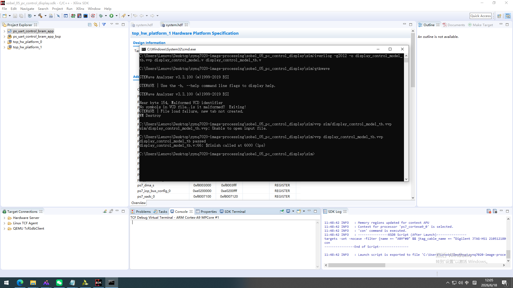

<p align="center">图23：仿真通过截图</p>

GTKWave 波形验证了 `display_mode` 从 00→01→10→11 切换时 `rgb_out` 的相应变化：

- mode=00（原图）：rgb_out = 原始像素值
- mode=01（灰度）：rgb_out = 灰度值复制到RGB三通道
- mode=10（边缘）：rgb_out = 二值化边缘（FFFFFF 或 000000）
- mode=11（叠加）：rgb_out = 红色边缘叠加到原图

threshold 从 50→78→50 变化，验证了阈值控制的有效性。

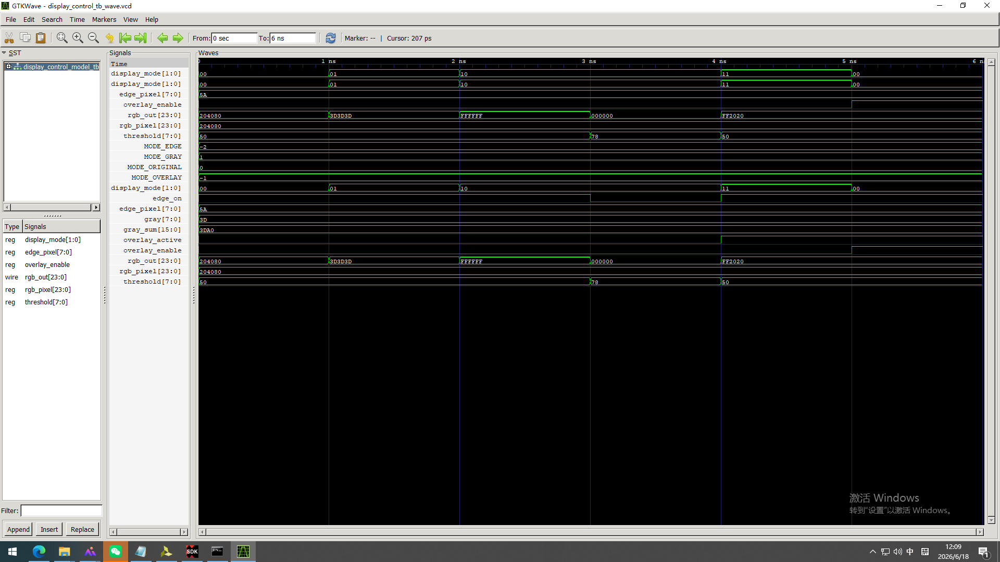

<p align="center">图24：GTKWave仿真波形截图</p>

### 6.5 上板验证

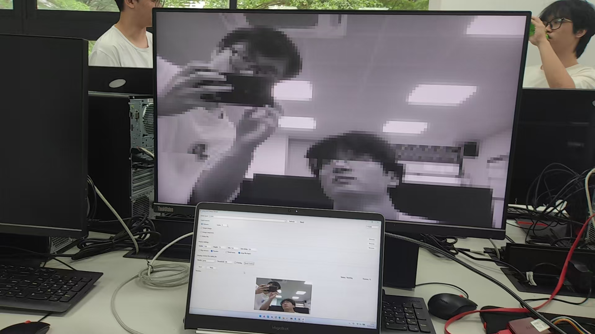

<p align="center">图25：灰度图显示模式</p>

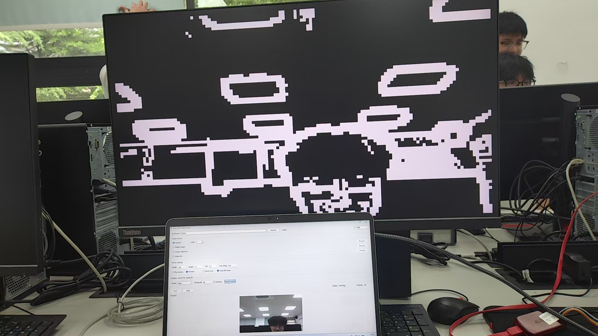

<p align="center">图26：Sobel二值化边缘图显示模式</p>

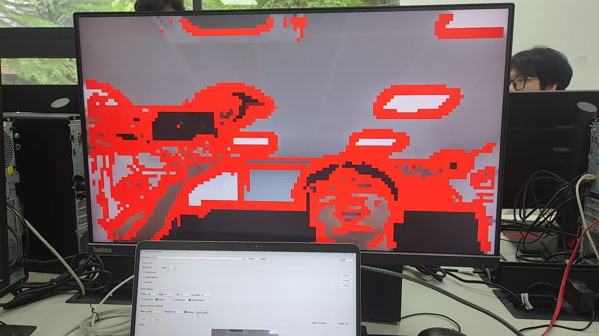

<p align="center">图27：原图+红色彩色边缘叠加显示模式</p>

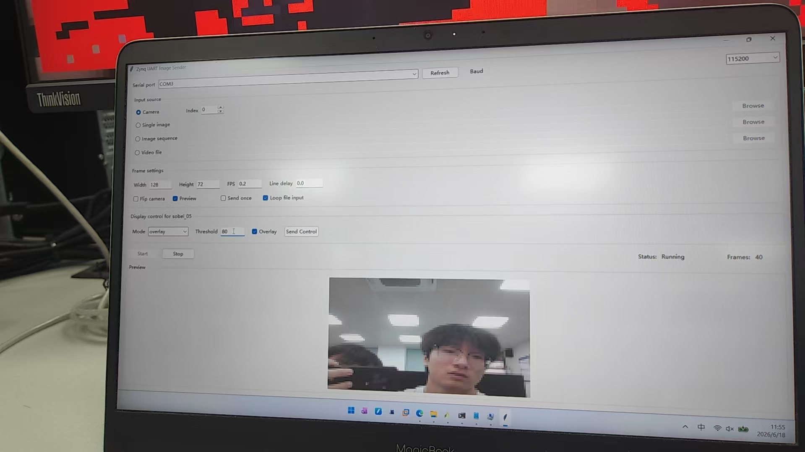

<p align="center">图28：PC端GUI控制界面（Mode=overlay, Threshold=80, Overlay=on）</p>

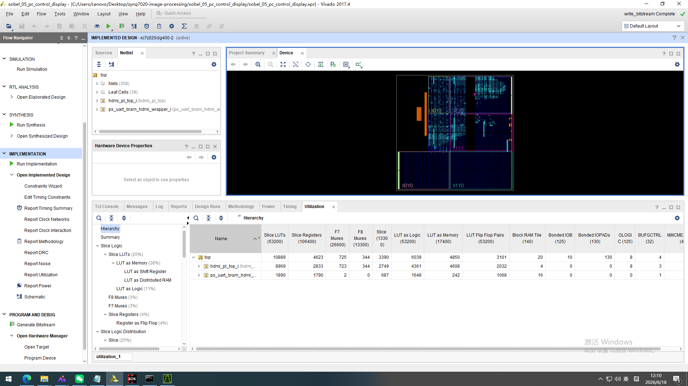

<p align="center">图29：实验05资源利用率</p>

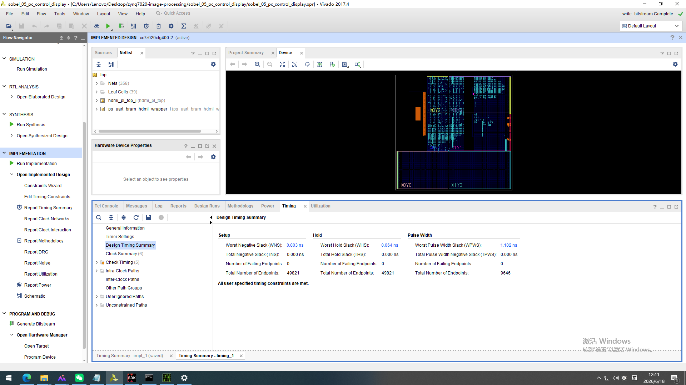

<p align="center">图30：实验05时序结果</p>

### 6.6 PL 端模式选择逻辑

**灰度图（mode=1）**：`R = G = B = gray`

**二值化边缘（mode=2）**：

```verilog
edge_bin = (edge_data >= threshold) ? 8'hFF : 8'h00;
R = edge_bin; G = edge_bin; B = edge_bin;
```

**彩色叠加（mode=3）**：

```verilog
if (edge_bin)
    RGB = red;        // 边缘区域显示红色
else
    RGB = original;   // 非边缘区域显示原图
```

---

## 七、实验总结

### 7.1 已完成的基础实验

| 序号 | 实验 | 完成状态 | 扩展 |
|------|------|----------|------|
| 01 | HDMI 固定图片显示 | 已完成 | 更换固定图片 |
| 02 | 固定图片 Sobel 边缘检测 | 已完成 | 边缘反色显示 |
| 03 | UART 传图 HDMI 显示 | 已完成 | 增加图像边框 |
| 04 | UART 输入 PL Sobel 显示 | 已完成 | 边缘图反色显示 |
| 05 | 上位机控制 HDMI 显示模式 | 已完成 | 灰度/边缘/叠加模式切换 |

### 7.2 收获与体会

1. 理解了 RGB 图像数据在 Verilog、BRAM 和串口协议中的表示方式。
2. 掌握了 HDMI 720p 显示时序、像素坐标和图像缩放关系。
3. 实现了 RGB 转灰度和 Sobel 边缘检测的硬件流水线。
4. 理解了 ZYNQ PS 与 PL 之间通过 AXI BRAM 共享图像数据的方式。
5. 掌握了上位机命令如何影响 PS 端控制寄存器和 PL 端显示逻辑。
6. 通过仿真验证了控制逻辑的正确性，再上板验证，体会了 FPGA 开发流程。
